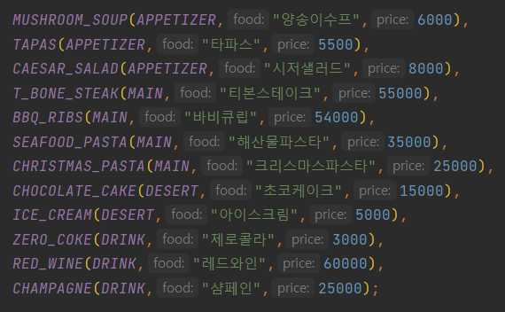

## 📌4주차 개발 목표

- [**JUnit과 AssertJ의 활용 범위를 넓히자!**](https://www.baeldung.com/parameterized-tests-junit-5)
    - `@MethodSource` `@VariableSource` 사용하기
- **private 함수를 테스트 하고 싶다면 클래스(객체) 분리를 고려하자**
    - private 함수를 외부로 꺼내서 해당 기능의 역할에 맞는 도메인에 public 으로 사용하자
      → 해당 역할을 수행하는 다른 객체를 만들 타이밍
- 필드를 최소화 하기 위해 `Class` , `Collectionenum` 을 적극 활용하자
- final 키워드를 사용 해 불변 값을 명시하자

## 🖥️기능 목록

|   **👾 도메인**     	    | **🛠️ 기능**          	                                                                                          | **📰 설명**                                 	                                              |
|:---------------------:|:---------------------------------------------------------------------------------------------------------------|:-----------------------------------------------------------------------------------------|
|    `크리스마스 이벤트`   	    | 게임 시작                     	                                                                                    | 로또 게임의 전체적인 흐름을 컨트롤하는 역할                                                                 |
|  `사용자 입력 유효성 검사`   	  | 날짜 유효성 검사                                                                                                      | 공백, 숫자 외 문자 입력, 숫자 1~31 벗어날 경우                                                           |
|  `사용자 입력 유효성 검사`   	  | 💭[메뉴 유효성 검사](https://screeching-knave-349.notion.site/891771864f8e4420b4ef4c8216e8d2df?pvs=4)                 | 사용자가 입력한 “메뉴-갯수” 에 대한 유효성 검증을 한다.                                                        |
| `ReservationDate`   	 | 사용자 예약 날짜                     	                                                                                | 사용자의 이벤트 예약 날짜를 담당하는 도메인으로 예약 날짜와 요일을 관리한다.                                              |
| `ReservationMenu`   	 | 사용자 예약 메뉴                     	                                                                                | 사용자의 이벤트 예약 메뉴를 담당하는 도메인으로 메뉴와 메뉴 갯수를 관리한다.     	                                        |
| `UserReservation`   	 | 회원 예약                     	                                                                                    | 사용자의 예약 정보를 담당하는 도메인으로 예약날짜와 예약메뉴를 관리한다.                                                 |
|     `DayType`   	     | 요일                     	                                                                                       | 월요일 ~ 일요일 정의                                	                                            |
| `AnniversaryDate`   	 | 기념일 날짜                     	                                                                                   | 기념일의 날짜와 요일을 정의                               	                                          |
|      `menu`   	       | 메뉴                     	                                                                                       | 메뉴 정보를 정의한 도메인으로 메뉴 타입, 음식이름, 가격에 대한 정보를 관리한다.                               	           |
|    `menuType`   	     | 메뉴 타입                     	                                                                                    | 메뉴의 종류에 대해 정의한 도메인                               	                                       |
|    `이벤트 참여조건`    	    | 1만원 이상부터 이벤트 참여                                                                                                | 1만원 미만일 경우 이벤트 참여 불가, 주문은 가능 → 총 금액 계산 필요                           |
|    `이벤트 참여조건`    	    | 음료 외 다른 음식 포함        	                                                                                         | 음료 단독 주문일 경우 주문불가 </br> → 메뉴에서 음료 구별 필요                                                  |
|    `이벤트 참여조건`    	    | 주문 메뉴 갯수                                                                                                       | 21개부터 주문불가                                     	                                         |
| `Event`,`증정 이벤트`   	  | 25000원 샴페인 증정           	                                                                                      | 할인 전 총 주문 금액이 12만 원 이상, 그렇지 않을 경우 “없음”                                                   |
| `Event`,`금액할인 이벤트` 	  | 크리스마스 디데이 할인        	                                                                                          | 1000원 시작, 날마다 100원씩 증가.</br>(최소 1000원/최대 3400원)                                          |
| `Event`,`금액할인 이벤트` 	  | 평일 할인                     	                                                                                    | 일,월,화,수,목,금 적용</br>디저트 메뉴 1개당 2023원 할인                                                   |
| `Event`,`금액할인 이벤트` 	  | 주말 할인                     	                                                                                    | 금,토 적용</br>메인 메뉴 1개당 2023원 할인                                                            |
| `Event`,`금액할인 이벤트` 	  | 특별 할인                     	                                                                                    | 일,크리스마스 적용 → 크리스마스 따로 구분필요 </br>별 표시 1000원 할인           	                                |
|  `EventBadge`      	  | 총 혜택 금액에 따른 배지      	                                                                                          | 5000-별</br>10000-트리</br>20000-산타 / 없음                                    	               |
|    `이벤트 메세지`     	    | 💭[이벤트 메세지](https://screeching-knave-349.notion.site/d148a728e60447958dc3b3499779c8b8?pvs=4)             	     | 이벤트 메세지를 UI에 표출                                                                          |
|    `사용자 메세지`     	    | 💭[사용자가 입력한 메세지](https://screeching-knave-349.notion.site/ca0135835fa94ae38e263bb69d7c5b56?pvs=4)              | 사용자가 입력한 메세지를 UI에 표출                                                                     |
| `ErrorMessage`     	  | 💭[예외 처리 예외메세지](https://screeching-knave-349.notion.site/1527386c59274d0b83b73e99943c36be?pvs=4)               | 예외 발생 시 메세지를 출력하고 해당 시점부터 다시 시작한다.                                                       |
|  `InputView`       	  | 💭[사용자 입력 출력 화면](https://screeching-knave-349.notion.site/fb5b07038914493fabc1cd51ff00827c?pvs=4)              | 메세지를 출력하고 사용자의 입력을 받는 화면                                                                 |
|  `OutputView`      	  | 💭[결과 출력 화면](https://screeching-knave-349.notion.site/9ef618737ee74de2888dfe1042b17c56?pvs=4)                	 | 사용자가 입력한 결과를 출력하는 화면                	                                                    |
|  `PrintUtil`       	  | UI 출력 기능                	                                                                                      | UI에 출력하기 위한 기능  	                                                                        |

---

## 주요 도메인 설계

### 🍖 `InputView`,`OutputView`클래스의 역할

InputView: 사용자의 입력을 받고 최소한의 유효성 검증 후 값을 반환하는 곳

OutputView: 가공된 사용자의 입력 값을 받아서 화면에 보여주기

✔️View 는 UI 에 표출하는 공간으로 다른 비즈니스 로직을 알 필요가 없다.

✔️도메인 로직과 View는 서로 알 필요가 없다.

<br>

### 🍝 메뉴를 어떻게 나눌까?

메인인지, 디저트인지, 음료인지 구별이 되어야 한다.

1. 사용자의 입력에 유효한 메뉴만 있는건지 (유효성 검사)
2. 사용자의 입력이 음료만 있는건지 (이벤트 참여 조건)
3. 주문 메뉴 갯수 20개 까지 가능 (이벤트 참여 조건)
4. 디저트 할인은 되는지 (주말 할인)
5. 메인메뉴 할인이 되는지 (평일 할인)

**`enum` 메뉴 (메뉴타입,음식명,가격)**
</br>



**`enum` 메뉴타입**
```
에피타이저, 메인, 디저트, 음료
```
<br>

### 🍰 이벤트를 어떻게 나눌까?

1. 사용자가 예약한 날짜와 요일, 메뉴타입을 알아야 한다. (`DateType`, `AnniversaryDate`)
<br></br>
2. `Interface` Event 를 만든 후 이벤트(`Class`) 별로 이벤트 프로세스를 구현하도록 한다.
<br></br>
3. 이벤트 별 조건
    1. **크리스마스 디데이 할인**: 금액, 날짜(1일~25일 100원씩 증가)
       <p>→ 1000원 시작, 날마다 100원씩 증가. (최소 1000원/최대 3400원)</p>

    2. **평일 할인**: 요일 , 메뉴타입(디저트)
       <p>→ 일,월,화,수,목,금 / 디저트 메뉴 1개당 2023원 할인</p>

    3. **주말 할인**: 요일 , 메뉴타입(메인메뉴)
       <p>→ 금,토 / 메인 메뉴 1개당 2023원 할인</p>

    4. **특별 할인**: 요일, 날짜(크리스마스)
       <p>→ 일,크리스마스 / 별 표시 1000원 할인</p>

    5. **증정 이벤트**: 금액
       <p>→ 할인 전 총 주문 금액이 12만 원 이상, 그렇지 않을 경우 “없음” / 25000원 할인 혜택</p><br>
4. 위 이벤트를 기준으로 `증정 메뉴`,`혜택 내역`,`총혜택 금액`,`할인 후 예상 결제 금액` 을 알 수 있다.